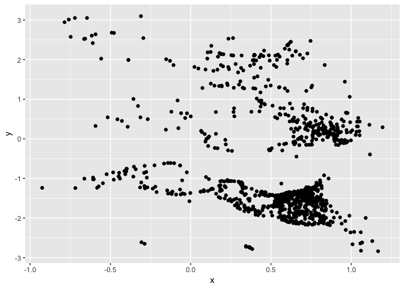
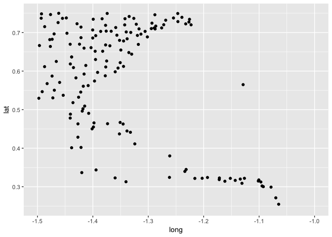
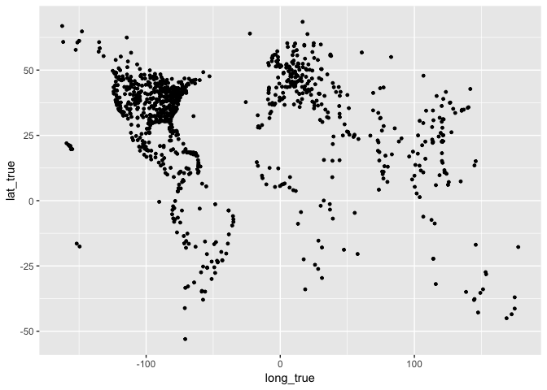
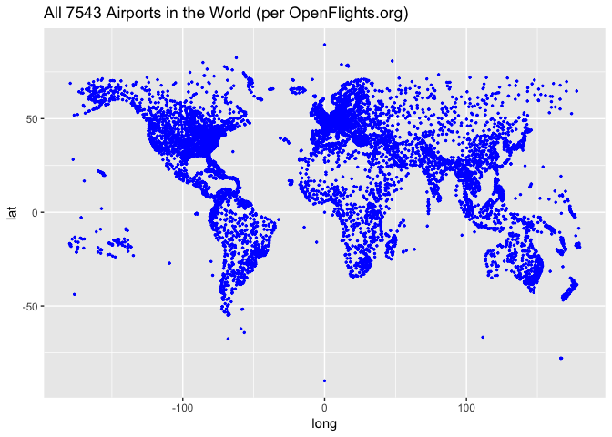

### Solving Hopper's Data Science Puzzle

In this notebook, I'll try to narrate my thought process as I see this data for the first time, and provide commentary on my analysis.

First, I read in the data and, since all we have is two un-named columns of doubles, I'll arbitrarily assign column names.

``` r
library(readr)
library(dplyr)
```

    ## 
    ## Attaching package: 'dplyr'

    ## The following objects are masked from 'package:stats':
    ## 
    ##     filter, lag

    ## The following objects are masked from 'package:base':
    ## 
    ##     intersect, setdiff, setequal, union

``` r
df <- read_csv("input/puzzle.csv", col_names = F, col_types = cols())
colnames(df) <- c("x", "y")
```

Next, I like to get a feel for the distribution of the data and to identify any potential relationship between the variables. Since there are only two variables here, the most straightforward way to do this is to throw them onto a scatter plot.

``` r
library(ggplot2)
ggplot(df, aes(x,y)) +
  geom_point()
```



Hmm... interesting. It almost appears that x and y are the points on an image, or geometric shapes. Let's flip the plot to see if that hypothesis holds true:

``` r
ggplot(df, aes(y, x)) +
  geom_point()
```


Aha! These are coordinates. Puzzle solved?

### Mapping Airports

Let's rename the columns, and see if we can rescale x and y to get the true (long, lat) coordinates of these points on Earth. Assuming these are airports, let's take advantage of the convenient fact that Bermuda has only one.

Sitting rather conspicuously off the Eastern Seaboard, BDA appears to lie somewhere in the broad bounding box

                (-1.5, 0.75)          (-1, 0.75)
                |              BDA             |
                (-1.5, 0.25)          (-1, 0.25)
                

Let's zoom in on it:

``` r
colnames(df) <- c("lat", "long")
df %>%
  ggplot(aes(x=long, y=lat)) + 
  geom_point() + 
  xlim(c(-1.5, -1)) +
  ylim(c(0.25, 0.75))
```

    ## Warning: Removed 871 rows containing missing values (geom_point).



From the looks of it BDA is somewhere around (-1.15, 0.575). Filtering, we can see which point exactly refers to BDA:

``` r
BDA <- 
  df %>%
  filter(long > -1.2, long < -1.1,
         lat > 0.55, lat < 0.6) %>%
  slice(1) %>%
  as.vector()
BDA
```

    ## # A tibble: 1 x 2
    ##     lat  long
    ##   <dbl> <dbl>
    ## 1 0.565 -1.13

So, in this dataset, the coordinates (0.5648583, -1.128856) represent BDA. Thanks to OpenFlights.org, we can check the actual coordinates of BDA. They are: (32.3640 -64.6787).

We can use the ratio of these sets of coordinates to rescale each point in the data:

``` r
true_BDA <- c(32.3640, -64.6787)
scale_factors <- true_BDA/BDA
df <- df %>%
  mutate(long_true = long*scale_factors$long,
         lat_true = lat*scale_factors$lat)
ggplot(df, aes(long_true, lat_true)) +
  geom_point(size = 1)
```



Naming Airports
---------------

Now that we've scaled longitudes and latitudes appropriately, why not figure out which airports the points refer to? Thanks to OpenFlights.org, we can do exactly that:

``` r
airports <- read_csv("https://raw.githubusercontent.com/jpatokal/openflights/master/data/airports.dat",
                     col_names = c(
                       "row", "name", "city", "country", "IATA", "ICAO", "lat", "long", "altitude", "timezone", "DST", "tz", "type", "source"
                     ),
                     na = "\\N",
                     col_types = cols()
                     )

airports$long = as.double(airports$long)
airports$lat = as.double(airports$lat)

ggplot(airports, aes(long, lat)) + geom_point(color = "blue", size = 0.5) + ggtitle("All 7543 Airports in the World (per OpenFlights.org)")
```

 To join with our dataset, we first have to round the values of lat, long (in both datasets). At this point, it makes sense to call our data what they (presumably) are: flights! I'll also group them by lat-long combination, and add an additional column "n" for the number of times each lat-long combo appears in the data.frame. This effectively gives us a data.frame of unique airports and their flight counts.

``` r
flights <- df %>%
  mutate(long_rd = round(long_true, 4),
         lat_rd = round(lat_true, 4)) %>%
  group_by(long_rd, lat_rd) %>%
  summarize(n = n())
airports <- airports %>%
  mutate(long_rd = round(long, 4),
         lat_rd = round(lat, 4))
```

Joining our dataset with the airports dataset:

``` r
combined <- flights %>%
  select(n, long_rd, lat_rd) %>%
  left_join(airports, by = c("long_rd", "lat_rd"))
nrow(combined[(is.na(combined$row)),])
```

    ## [1] 29

We didn't get a perfect join, as 28 of 912 airports in our dataset could not be matched with OpenFlight's. This might be because the OpenFlight coordinates differ, however slightly, from those in our data. After all, 0.001 degrees equates roughly to (depending on your longitude) a distance of 111 meters, which is a pretty large margin of error for whoever was tasked with tagging all 7543 airports' coordinates.

Given that, and the fact that we calculated our coordinates, this is a pretty good result.

But I'm not satisfied. I'll join the data frames again, but in a "fuzzy" way, using the fuzzyjoin package which has functions for inexact joining. In order to fuzzyjoin our datasets, I first need to write a vectorized function that, given the two columns (e.g. of latitudes), decides where they match each other.

My criteria for a match is that the values be within 0.02 degrees of each other. This is approximately 2.2 kilometers, which is a little risky, since there may be some places (thinking NYC with LaGuardia and JFK, Seattle with King County/Sea-Tac, or Chicago with O'Hare and Midway and all the densely populated places in the world I've yet to visit) that have two airports in close proximity. But for **both** the latitude and longitude of two major airports to be within 2.2 km of each other is quite unlikely.

I've made this distance an argument in my matching function, so that I can come back and change this later if need be.

``` r
library(fuzzyjoin)

my_match_fun <- function(col1, col2, distance = 0.02){
  matches <- vector(mode = "logical", length = length(col1))
  for(i in 1:length(col1)){
    if(abs(col1[i]-col2[i]) <= distance){
      matches[i] = TRUE
    } else{
      matches[i] = FALSE
    }
  }
  return(matches)
}

fuzzy_combined <- flights %>%
  select(n, long_rd, lat_rd) %>%
  fuzzy_left_join(airports, by = c("long_rd", "lat_rd"), my_match_fun)

nrow(fuzzy_combined[(is.na(fuzzy_combined$row)),])
```

    ## [1] 11

Success! We've more than halved the number of missing airports.

### Solution

At this point, we have 902/912 of the unique coordinate pairs in our file not only scaled properly, but mapped to actual airports. Here are the 10 airports appearing most frequently in the dataset:

``` r
combined %>%
  select(n, name, city, country, IATA, ICAO, altitude, timezone, long = long_rd, lat = lat_rd) %>%
  arrange(desc(n)) %>%
  head(10) %>%
  knitr::kable()
```

|    n| name                                         | city              | country        | IATA | ICAO |  altitude|  timezone|       long|      lat|
|----:|:---------------------------------------------|:------------------|:---------------|:-----|:-----|---------:|---------:|----------:|--------:|
|  101| Taitung Airport                              | Fengnin           | Taiwan         | TTT  | RCFN |       143|         8|   121.1020|  22.7550|
|    2| Ted Stevens Anchorage International Airport  | Anchorage         | United States  | ANC  | PANC |       152|        -9|  -149.9960|  61.1744|
|    2| Tri-Cities Regional TN/VA Airport            | BRISTOL           | United States  | TRI  | KTRI |      1519|        -5|   -82.4074|  36.4752|
|    2| Alfonso Bonilla Aragon International Airport | Cali              | Colombia       | CLO  | SKCL |      3162|        -5|   -76.3816|   3.5432|
|    2| Pinto Martins International Airport          | Fortaleza         | Brazil         | FOR  | SBFZ |        82|        -3|   -38.5326|  -3.7763|
|    2| Francisco de Sá Carneiro Airport             | Porto             | Portugal       | OPO  | LPPR |       228|         0|    -8.6814|  41.2481|
|    2| Southend Airport                             | Southend          | United Kingdom | SEN  | EGMC |        49|         0|     0.6956|  51.5714|
|    2| Palma De Mallorca Airport                    | Palma de Mallorca | Spain          | PMI  | LEPA |        27|         1|     2.7388|  39.5517|
|    2| Düsseldorf Airport                           | Duesseldorf       | Germany        | DUS  | EDDL |       147|         1|     6.7668|  51.2895|
|    2| Naples International Airport                 | Naples            | Italy          | NAP  | LIRN |       294|         1|    14.2908|  40.8860|

Unfortunately, this seems like a random slice of 1024 flights, 102 of which are arriving/departing from Taitung Airport in Taiwan (perhaps early morning there?). Not much more to gain by analyzing this any further, but I'll write the result to CSV and make one final plot, overlaying the coordinates on a map of the world using the maps/mapdata package.


|  Count| IATA | Airport                                      | City              | Country        |
|------:|:-----|:---------------------------------------------|:------------------|:---------------|
|    101| TTT  | Taitung Airport                              | Fengnin           | Taiwan         |
|      2| ANC  | Ted Stevens Anchorage International Airport  | Anchorage         | United States  |
|      2| TRI  | Tri-Cities Regional TN/VA Airport            | BRISTOL           | United States  |
|      2| CLO  | Alfonso Bonilla Aragon International Airport | Cali              | Colombia       |
|      2| FOR  | Pinto Martins International Airport          | Fortaleza         | Brazil         |
|      2| OPO  | Francisco de Sá Carneiro Airport             | Porto             | Portugal       |
|      2| SEN  | Southend Airport                             | Southend          | United Kingdom |
|      2| PMI  | Palma De Mallorca Airport                    | Palma de Mallorca | Spain          |
|      2| DUS  | Düsseldorf Airport                           | Duesseldorf       | Germany        |
|      2| NAP  | Naples International Airport                 | Naples            | Italy          |
|      2| SOF  | Sofia Airport                                | Sofia             | Bulgaria       |
|      2| ISL  | Atatürk International Airport                | Istanbul          | Turkey         |
|      2| LEA  | Learmonth Airport                            | Learmonth         | Australia      |
